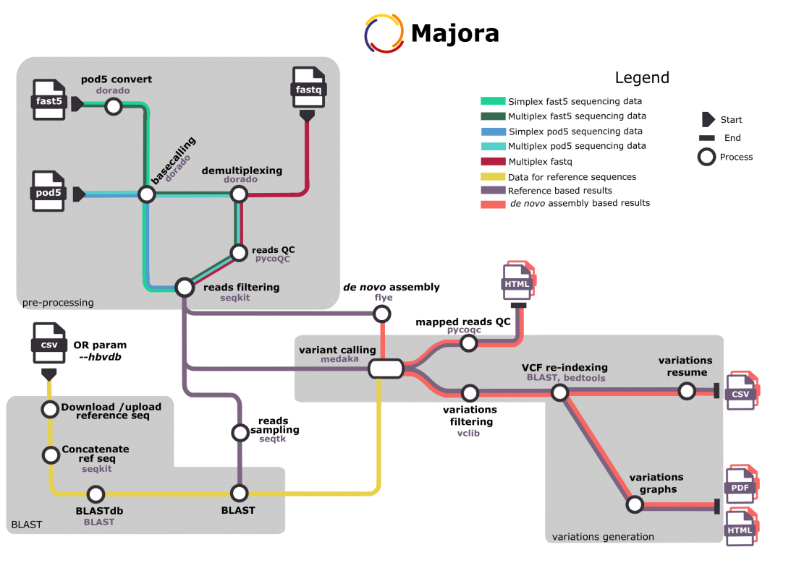

<div align="center">
  
</div>

---

Majora is a nextflow pipeline for genotyping and caracterizing variants of Hepatitis B viruses from MinION sequencing reads. The pipeline supports raw FAST5/POD5 files dans FASTQ inputs and performs basecalling, demultiplexing, BLAST, *de novo* assembly and variant calling. In addition, it also outputs graphs for variations visualization.

## Pipeline summary

---
<div align="center">
  
</div>

## Installation

---

#### Prerequisites

- Nextflow (version 24.10.04)
- Docker or Singularity or charliecloud or podman or psmn # à vérifier avec Xavier

```bash
git clone https://github.com/XavierGrand/majora.git
```

## Getting started

---

The pipeline `src/majora.nf` works a nextflow configuration file `src/nextflow.config`.
The standard command for running the pipeline starts with:
`nextflow ./src/majora.nf -c ./src/nextflow.config -profile <profile>`
Followed with the appropriate input parameter which depends of the input type:

- `--fast5 <path_for_fast5>`
- `--pod5 <path_for_pod5>`
- `--fastq <path_for_fastq>`

To obtain help: `nextflow ./src/majora.nf --help`

The arguments of the pipeline are described in the table below:

|           Argument           |                                                                                             Description                                                                                             |
| :--------------------------: | :--------------------------------------------------------------------------------------------------------------------------------------------------------------------------------------------------: |
|              -c              |                                                                  Configuration file. This always should be `src/nextflow.config`                                                                  |
|           -profile           | The profile to use. This can be**docker** or **singularity** to run the pipeline in docker or in singularity respectively. This can also be **psmn** or **charliecloud.**  |
| --fastq or --fast5 or --pod5 |                                                                            Input folder with appropriate file extension.                                                                            |
|          --fwprimer          |                                                                                      Sequece of forward primer                                                                                      |
|         --revprimer         |                                                                                      Sequence of reverse primer                                                                                      |
|           --hbvdb           |                                                                              Dowloads hbv genomic sequences from hvbdb                                                                              |
|           --ref_db           |                                                                                  To upload user's csv database file                                                                                  |
|          --help --h          |                                                                                       To display help message                                                                                       |


## Test Majora

---

## BLAST database creation

---

The pipeline uses references for genotyping samples using BLASTn. The BLAST database can be generated using on of the three user-defined options, each corresponding to a specific option:

- **Downloading sequences from HBVdb:**
  - **By genotype:**
    With the `--hbvdb` parameter, the user can select either all sequences from the HBV database or only those associated with a specific genotype. The user should specify either "all" (for the entire database) or the uppercase letter representig the desired genotype.
  - **By sequence identifiers:**
    With the `--ref_db` option, the user will create a custom BLAST databse using specific sequence identifiers from HBV database. To do so, the option must be followed by a CSV (tab separated with header) file with sequences ID contained in the second column.
- **Using a custom multi-fasta file**:
  For users who have pre-selected sequences, this option allows them to create a BLAST database directly from a multi-fasta file containing the chosen sequences of interest. To so do, the user should use the option `user_db` followed by the multi-fasta file path.

## Inputs of Majora : Three cases

---

The pipeline can process three types of files :

- Raw nanopore data with **pod5** or **fast5** extension
- **Fastq** files from nanopore sequencing

The input file must be associated with the corresponding option: `--fast5` or `--pod5` or `--fastq`.

## Outputs of Majora

---

The pipeline outpus multiple directories organized and named as follows:

```
results/
├── 01_pod5convert
├── 02_basecalling
├── 02_basecalling_nobc
├── 03_demux
├── 04_reads_stats
├── 05_convert_fastq
├── 06_grep_primer
├── 07_filterbylength
├── 08_sample_fastq
├── 09_dl_hbvdb
├── 10_make_ref_db
├── 11_double_fastaref
├── 12_makeblastdb
├── 13_blast_them_all
├── 14_extract_ref
├── 15_quality_control
├── 16_call_hap_variant
├── 17_annotate_variant
├── 18_de_novo
├── 19_call_de_novo_variant_hap
├── 20_vcf_filter
├── 21_reindex_vcf
├── 22_lollipop_vcf
└── report.html
```

Brief presentation of what each directory contains:

**01_pod5convert**
Contains fast5 data, this directory will store the resulting pod5 file after conversion

**02_basecalling and 02_basecalling_nobc**

- **02_basecalling**
  If the data are barcoded, basecalled sequences from the pod5 file are stored in this folder. In this case, the `--no-trim` option is used with the `dorado basecaller` command to preserve barcode sequences.
- **02_basecalling_nobc**
  If the input data are NOT barcoded, the basecalled sequences from pod5 file are stored in this folder.

**03_demux**
Contains a bam file for each demultiplexed sample, along with a summary file. The summary lists each sequence ID and its corresponding sample. Sequences that could not be assigned to any sample are grouped under "unclassified".

**04_read_stats**
Contains a tab separated file for each sample that stores data related to sequences length and number.

**05_convertfastq**
Contains on fastq file for each sample.

**06_grep_primer**
Contains a folder for each sample with compressed fastq file of reads containg primer sequences in their sequence. It also contains a file with informations about the authorized calculated mismatch for each primer and a summary that stores data related to sequences length and number for filtered sequences.

**07_filterbylength**
Each sample contains a compressed fastq file of reads that match the calculated length limits. It also includes a text file xoth the calculated limits dans a summary file with that calculated limits and a summary file that stores data on sequences lengths and the number of filtered sequences.

**08_sample_fastq**
A subset of 100 reads (default but this value can be modified) for each sample is used for the BLAST alignment. This folder contains the subset reads fasta file.

**09_dl_hbvdb & 10_make_ref_db**

- **09_dl_hbvdb**
  Only if the user chose to use the option `--hbvdb`, a fasta file with all the selected sequences will be stored in this folder.
- **10_make_ref_db**
  If the user chose the parameter `--refdb`, a fasta file containing all the chosen sequences will be produced.

**11_double_fastaref**
Reference sequences are concatenated and the resulting fasta file is located in this folder.

**12_makeblastdb**
Files related to BLASTn database creation are stored in this folder.

**13_blast_them_all**
Contains three files for each sample:

1. *hits.txt* lists all he hits from the BLASTn alignment against previously sampled sequences (08_sample_fastq).
2. *hits_counts.txt* provides the ID of each hit along with the number of matching sequences from the sample.
3. *best__ref.txt* contains the reference sequence ID with the highest number of matching sequences.

**14_extract_ref**
Contains the fasta file with the sequence of the best hit from the BLASTn alignement.

**15_quality_control**
Contains pycoQC results.

**16_call_hap_variant**
Includes medaka variant caller results: a vcf file with detected variants, minmap2 alignment outputs (bam and bai files), along with the medaka log file.

**17_annotate_variant**
Contains the annotated medaka vcf file that stores  additional informations.

**18_vcf_filter**
Contains the annoted medaka vcf file with variations having a quality score of at least 20.

**19_reindex_vcf**
Because of experimental design (see explanation [here](./doc/reindexing_info.pdf)), variant positions must be reindexed. This folder contains the reindex vcf file.

**22_lollipop_vcf**
Contains graphical respresentations of detected variants for each sample.

**report.html**
Contains the nextflow report regarding the run.

## Authors

---

## License

This project is licensed under the CeCiLL License- see the [LICENSE](./LICENSE/) folder for details.
The optional basecalling and demultiplexing steps may be carried out if necessary but are not executed automatically.
To execute these steps, it is essential to adhere to the guidelines provided with the Dorado software from Oxford Nanopore Technologies.
